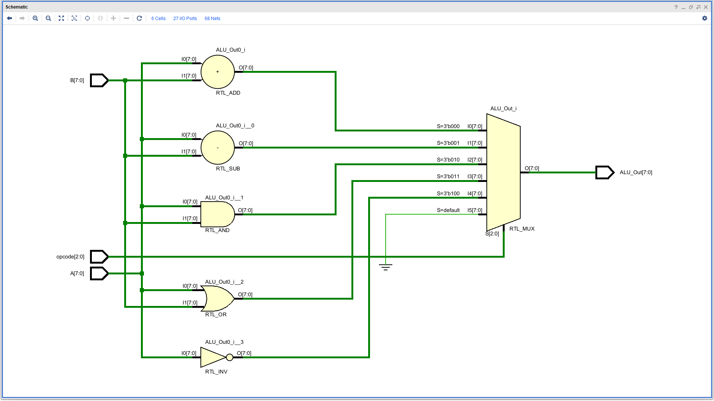
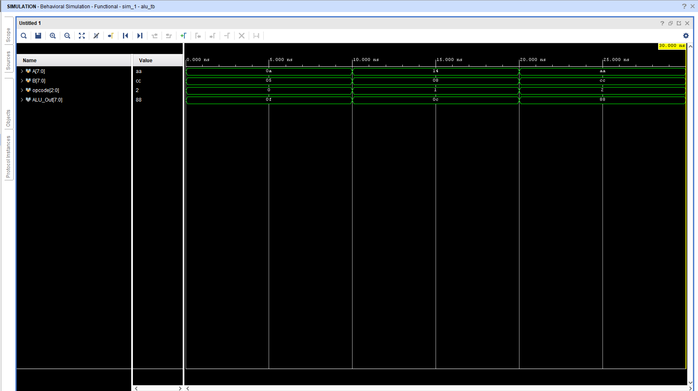
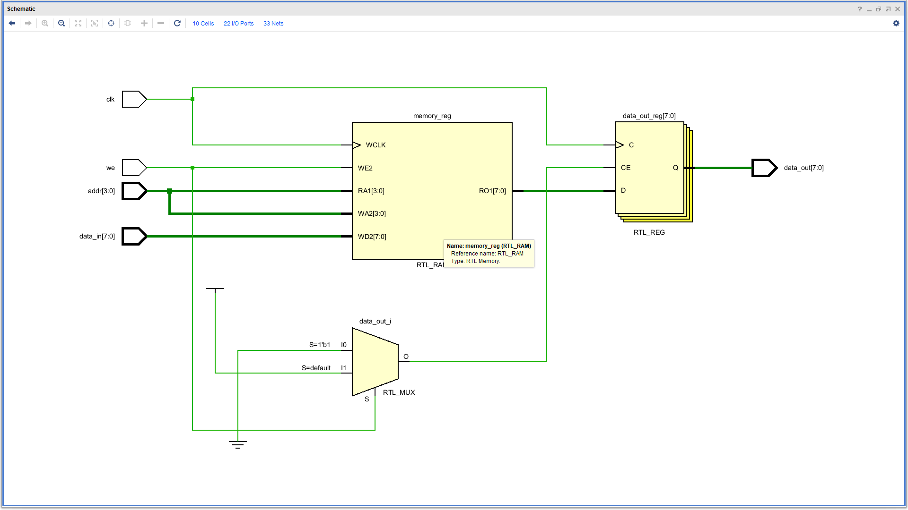
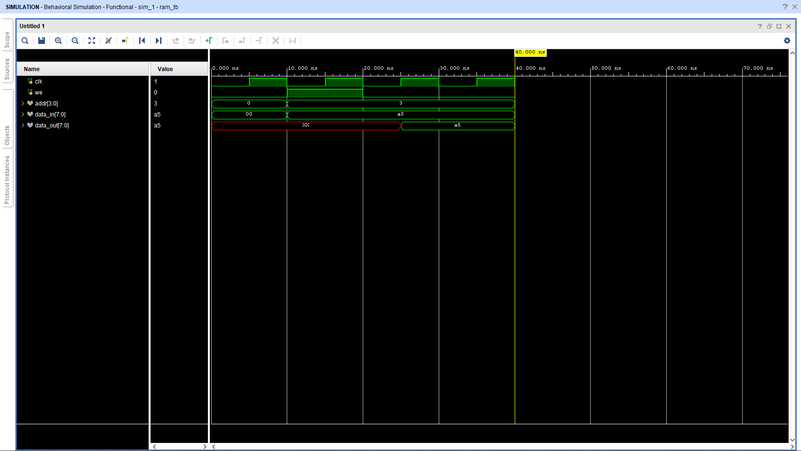
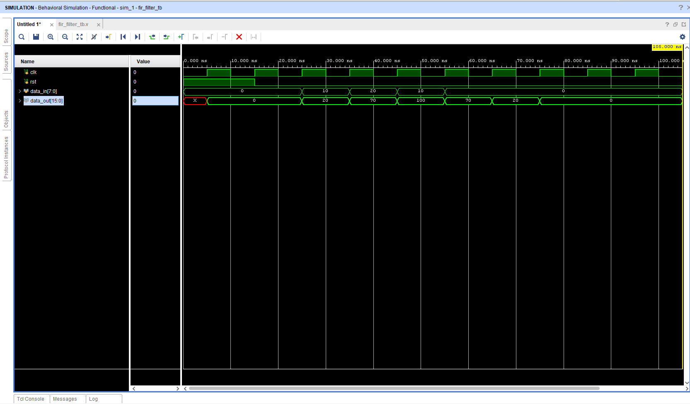
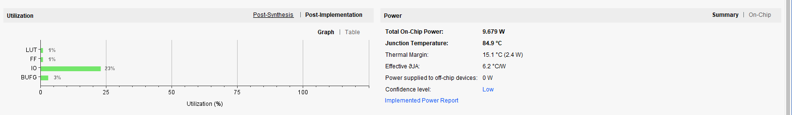

# VLSI Design & Digital System Architecture 

**COMPANY**: CODTECH IT SOLUTIONS  
**NAME**: KISHAN SINGH  
**INTERN ID**: CTIS7820  
**DOMAIN**: VLSI DESIGN  
**DURATION**: 6 WEEKS  
**MENTOR**: NEELA SANTOSH  

---

## 📖 Internship Overview
This repository showcases RTL designs developed during my VLSI Internship at **Codtech IT Solutions**. The project focuses on designing, simulating, and verifying core digital components using **Verilog HDL** and **Xilinx Vivado**.

## 🛠️ Technical Portfolio

### 1. 8-Bit Arithmetic Logic Unit (ALU)
*   **Description**: A versatile unit performing Addition, Subtraction, AND, OR, and NOT operations.
*   **Design**: Implemented using behavioral modeling with a focus on optimized gate-level synthesis.
*   **Visual Proof**:
    *   **RTL Schematic**: Shows the logic flow and multiplexer-based operation selection.
    
    *   **Simulation Waveform**: Verified functionality for various opcodes.
    

---

### 2. Synchronous 16x8 RAM Module
*   **Specs**: 16 locations, 8-bit data width.
*   **Features**: Single-clock synchronous read/write operations with dedicated reset logic.
*   **Visual Proof**:
    *   **RTL Schematic**: Illustrates the memory register bank and control logic.
    
    *   **Simulation Waveform**: Confirms data integrity during read and write cycles.
    

---

### 3. 4-Stage Pipelined Processor
*   **Architecture**: Features Instruction Fetch (IF), Instruction Decode (ID), Execute (EX), and Write Back (WB) stages.
*   **Goal**: Maximizing instruction throughput by overlapping execution stages.
*   **Visual Proof**:
    *   **RTL Schematic**: Demonstrates the four-stage register-based pipelining.
    
    *   **Simulation Waveform**: Verified the instruction flow through the pipeline.
    

---

### 4. 3-Tap Digital FIR Filter
*   **Architecture**: Implements Multiply-Accumulate (MAC) logic for real-time digital signal processing.
*   **Visual Proof**:
    *   **Simulation Waveform**: Mathematical filtering accuracy verified in signed decimal radix.
    
    *   **Hardware Analysis**: Monitored LUT, Flip-Flop, and power utilization.
    

---

## 🚀 Tools & Technologies
*   **HDL**: Verilog
*   **IDE**: Xilinx Vivado
*   **Analysis**: Functional Simulation, RTL Analysis, and Hardware Utilization.

## 📈 Key Results
*   Successfully verified all modules through extensive Testbench simulations.
*   Analyzed the Pipelined Processor for instruction hazards and throughput efficiency.
*   Confirmed hardware feasibility through synthesis and resource utilization reports.

---
*Maintained by Kishan Singh | Electronics & Communication Engineering Student*
